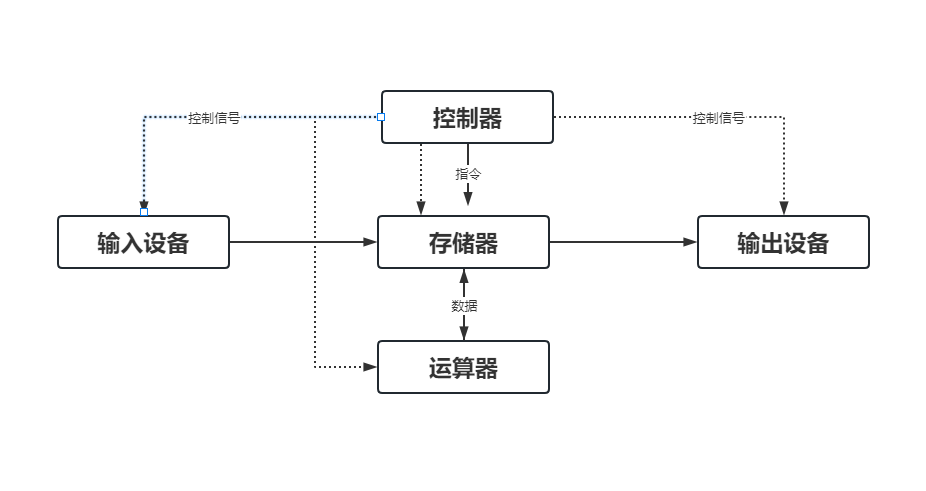

<!--
 * @Author: duxinyues yongyuan253015@gmail.com
 * @Date: 2023-03-20 22:08:58
 * @LastEditors: duxinyues yongyuan253015@gmail.com
 * @LastEditTime: 2023-03-23 18:42:35
 * @FilePath: \blog\reading\computerYheory.md
 * @Description: 
 * Copyright (c) 2023 by ${duxinyues} email: ${yongyuan253015@gmail.com}, All Rights Reserved.
-->

# 计算机概论

## 计算机的发展历程

1. 1946年第一台点子数字积分计算机【电子管时代】，逻辑元件采用电子管；使用机器语言进行编辑；主存用延迟或者磁鼓存储信息，容量极小，体积大，成本高，运算速度低。
2. 晶体管时代【1958年~1964年】，逻辑元件采用晶体管，运算速度达到了每秒几万到几十万；主存采用磁芯存储器，软件开始使用高级语言开发
3. 中小规模的集成电路时代【1965年~1972年】，逻辑元件采用了中小规模的集成电路；半导体存储器开发取代了磁芯存储器；高级语言和操作系统得到迅速发展。开始有了分时操作系统。
4. 超大集成电路时代【1972年至今】，逻辑元件采用了大规模集成电路和超大规模集成电路，产生可微处理器，半导体存储完全取代了磁芯存储器。

## 计算机硬件

计算机硬件由运算器、存储器、控制器、输入设备和输出设备组成：

### 运算器

 运算器是在控制器的指令下，对数据或者信息进行处理和运算，这就是算术逻辑运算单元

### 控制器

控制器是计算机的控制中心，用来实现计算机本身运算过程的自动化。它控制计算机各个部件按照指令功能进行所需的操作。

### 存储器

存储器是计算机用来存储程序和数据的记忆部件。是计算机各种信息数据存放和交流中心。

存储器是在控制器的指挥下按照指定的地址存入或者取出数据。

（1）、主存【内存】是由CPU直接访问的存储器，存放着正在运行的程序和数据，也可以存放计算结果或者中间结果。因为主存直接和运算器、控制器交换数据，所以要求存取速度快。现在计算机的主存采用了大规模集成电路制作成的半导体存储器，它的优点是存储容量大、体积小、重量轻、存取 速度快。

（2）、高速缓存【Cache】，存取速度比主存快，但是CPU内部的寄存器慢，容量小，经常被放置在CPU和主存之间。

（3）、外存是计算机的外围设备，用来存储大量暂时不需要参与计算的数据或者程序。所以允许存取速度慢。比如磁盘存储器、磁带存储器、光盘存储器。

### 输入和输出设备

输入和输出设备是计算机和外界联系的桥梁。

输入设备：键盘、鼠标、扫描仪等等。
输出设备：显示器、打印机、绘图仪等等。

### 总线

总线是一组由多个功能部件共享的公共信息传送线路。比如：

总线一般包含3组：地址总线、数据总线和控制总线。

地址总线是单向的，CPU用它来传送主存单元地址或者输入/输出端口地址。

数据总线主要是用于传送各个大部分部件之间的数据信息。比如数字、命令字和状态字。

控制总线是用于传送控制信号和时序信号。

---

## 计算机软件

---

计算机软件是计算机系统的重要组成部分，软件将各种计算机的指令组合起来，让计算机硬件部分能够正常工作。

软件分为系统软件和应用软件。

系统软是一组保证计算机系统高效、正确运行的基础软件，一般作为操作系统资源提供给用户使用的。比如操作系统、语言处理系统，数据管理系统、分布式软件系统、网络软件系统。

